# MRI Breast Segmentation
End-to-end pipeline for breast MRI analysis, including tissue segmentation, tumor candidate extraction, quantitative feature computation, and exploratory clinical correlation.


## Overview
This project implements an end-to-end workflow for analyzing 3D breast MRI scans.
The pipeline performs breast tissue segmentation using a U-Net–based model,
followed by quantitative feature extraction and exploratory analysis.

Segmentation outputs are further processed to derive tumor candidate regions, from which imaging features are computed and analyzed in conjunction with available clinical metadata.

The focus is on building a clear, reproducible medical-imaging pipeline rather
than optimizing for maximum model accuracy.

For a step-by-step walkthrough of the full pipeline, including code, visualizations,
and intermediate results, see the accompanying Jupyter notebook.

**Quick links:**  
- [Qualitative Segmentation Results](#qualitative-inference-visualization)  
- [Mask alignment](#mask-alignment)
- [Dice vs. Threshold](#dice-vs-threshold)
- [Full inference pipeline: breast mask → tumor candidate → features](#full-inference-pipeline-breast-mask-to-tumor-candidate-to-features)


## Datasets

### Imaging Data
- **Input:** 3D breast MRI volumes (NIfTI format)
- **Labels:** Binary breast tissue masks
- **Training set:** 50 labeled scans
- **Test set:** 20 unlabeled scans

All volumes are processed slice-wise for 2D model training and inference.

### Clinical Data
- Structured patient-level metadata (e.g., ER, PR, HER2 status, molecular subtype, Nottingham grade)
- Used for exploratory correlation analysis with imaging-derived features
---
### Data Validation
Before any processing, the pipeline performs fail-fast validation of the dataset
structure, ensuring that all required folders (scans, ground-truth masks,
inference data) and clinical metadata files exist and are non-empty.

Expected directory structure:
```
dataset_root/
├── train/
│   ├── scans/          # 3D MRI volumes (.nii / .nii.gz)
│   └── masks/          # Binary breast tissue masks
├── inference/
│   └── scans/          # Unlabeled test MRI volumes
└── clinical.csv        # Structured clinical metadata
```
---

### Clinical Data Exploration

The distribution of key clinical variables (ER, PR, HER2 status, molecular subtype,
and Nottingham grade) was analyzed to assess label balance and identify missing or
underrepresented categories prior to downstream analysis.

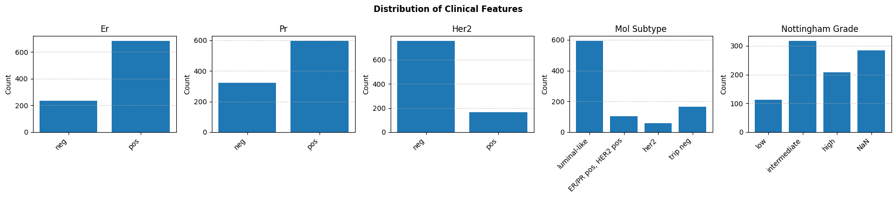

Overall, the clinical labels show moderate class imbalance, particularly for
HER2 status and molecular subtypes, which informed downstream analysis decisions.

---
### Image Orientation Consistency Normalization

All MRI scans were first validated to ensure consistent voxel spacing and
coordinate orientation using the NIfTI affine metadata.

Although all MRI volumes shared identical affine matrices and voxel spacing,
visual inspection revealed **inconsistent anatomical orientation across patients**.

Specifically, axial slices showed that in some scans the breast tissue appeared
at the top of the image rather than the bottom, indicating vertical or head–foot
axis inversions not captured by affine metadata alone.

Deep learning models are sensitive to spatial consistency. Without correcting
these orientation discrepancies, the network would receive visually different
representations of the same anatomy, degrading both training stability and
interpretability.

### Approach (Heuristic-Based Normalization)

Orientation was standardized using intensity-based heuristics:

- **Axial vertical consistency**  
  Breast tissue is expected to appear in the lower half of axial slices.
  Mean intensity in the upper vs. lower half of a representative axial slice
  was compared to detect vertical flips.
  
  - A representative axial slice near the top of the volume (90th percentile along the z-axis) is selected.
  - The slice is split into upper and lower halves.
  - Mean intensity is computed for each half.
  - Decision rule: If the lower half has higher mean intensity, the orientation is assumed correct. Otherwise, flip along axis 0


- **Head–foot (Z-axis) ordering**  
  Some MRI volumes exhibit inconsistent slice ordering along the head–foot (Z) axis.
To detect and correct reversed Z-axis ordering, a second intensity-based heuristic is applied:

  - Two representative axial slices are selected:

    - One near the upper part of the volume (10th percentile along the Z-axis).
    - One near the lower part of the volume (90th percentile along the Z-axis).
    - The mean intensity of each slice is computed and compared.

  - Anatomical assumption:

    This heuristic is motivated by anatomical priors: superior chest slices
  typically contain more osseous structures (clavicles, ribs, spine), which
  tend to exhibit higher signal intensity than inferior slices dominated by
  soft tissue.

  - Decision rule:

    - If the lower slice has higher mean intensity than the upper slice, the Z-axis ordering is assumed to be reversed.
    - In this case, the volume is corrected by reversing the slice order along the Z-axis.
  

When inconsistencies were detected, the volume was flipped along the relevant axis.
These normalization is applied automatically during data loading.

### Orientation Normalization — Result

After normalization:

- All axial slices follow a consistent vertical convention
- Z-axis ordering is consistent across patients
- Visualization and downstream preprocessing are stable and reproducible

### Slice Visualization (Sanity Check)

The figure below shows representative MRI slices arranged in a **3×5 grid**:

- **Rows:** anatomical planes (sagittal, coronal, axial)
- **Columns:** slice percentiles. Each plane is sampled at 10%, 25%, 50%, 75%, and 90% of its axis, giving a compact summary of the entire 3D scan


**Before normalization:**

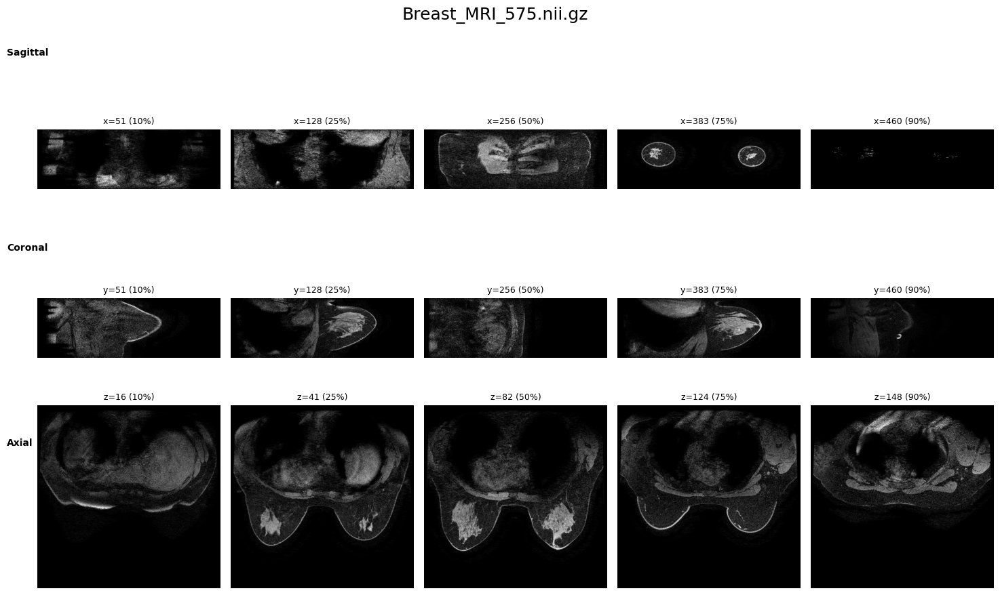

**After normalization:**

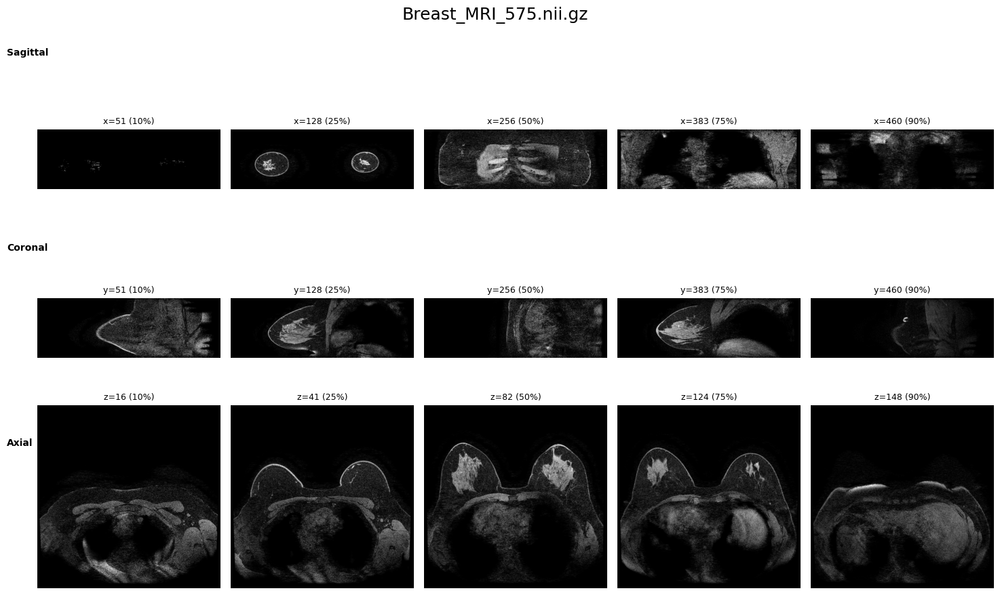

---

### Mask alignment

Ground-truth masks occasionally exhibit axial or left–right misalignment relative to the scans. Two corrective steps are applied:

- **Axial normalization (mask-only)**
Ensures masks point upward by analyzing the vertical distribution of mask mass in the axial slice with maximum foreground area.

- **Left–right alignment (mask + scan)**
Chooses the orientation that minimizes overlap between the mask and low-intensity background regions in the scan.

These corrections are lightweight, deterministic, and fully automatic. They ensure that all image–mask pairs are spatially aligned before training and evaluation.

**Example visualization (before any correction):**

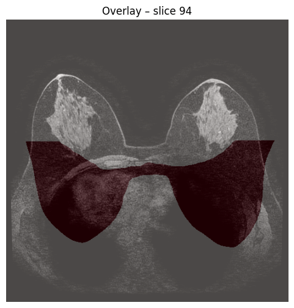

**After axial “up” correction**

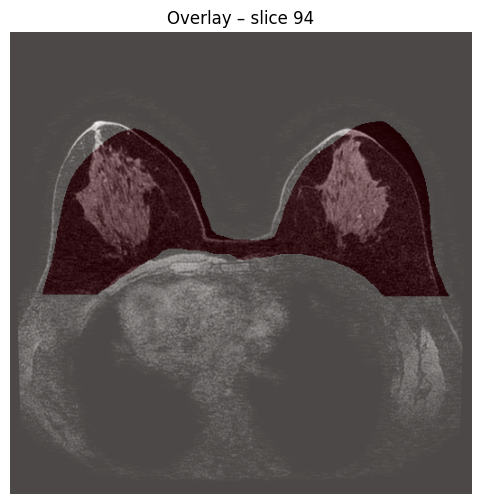

**After left–right alignment with scan:**

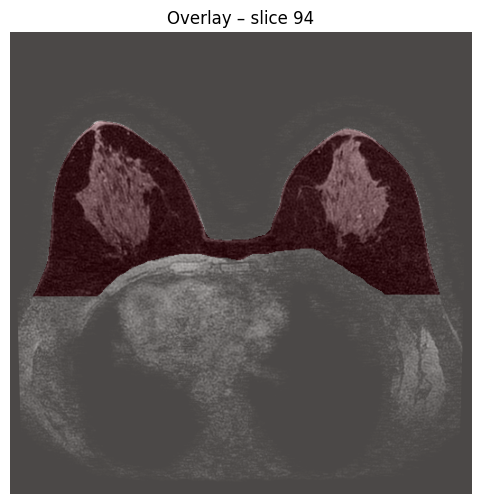

---
## Building the Slice-Level Dataset

This stage constructs the final dataset used for training the segmentation model.
Each patient’s 3D scan and mask are geometrically aligned and then converted into
2D axial slice pairs suitable for a U-Net–style architecture.


### Per-Patient Preprocessing (`_process_one`)

For each patient, the following steps are performed:

1. **Extract patient ID from filename**
   - The numeric patient identifier is parsed from the scan filename.

2. **Load scan and mask volumes**
   - Both scan and mask are loaded as NumPy arrays with shape `H × W × Z`.

3. **Apply orientation corrections**
   - `check_axial_orientation(scan)`
     - Ensures the scan is oriented so that breast tissue appears at the bottom
       of the axial image.
   - `orient_mask_up(mask)`
     - Corrects upside-down masks using mask geometry only.
   - `align_mask_left_right(scan, mask)`
     - Resolves left–right mismatches by comparing mask overlap with
       low-intensity background regions in the scan.

4. **Return aligned volumes**
   - Outputs the corrected 3D scan and 3D mask volumes.


### Dataset Assembly (`build_patient_df`)

The full dataset is constructed as follows:

1. **Parallel preprocessing**
   - All patients are processed in parallel using multiprocessing.

2. **Build a patient-level DataFrame**
   - Each row corresponds to one patient and includes:
     - `patient_id`
     - `img` (3D scan volume)
     - `mask` (3D mask volume)

3. **Patient-level train/validation split**
   - The split is performed at the patient level (not slice level) to prevent
     data leakage between training and validation sets.

4. **Explode 3D volumes into 2D axial slices**
   - Each 3D scan and mask is decomposed into corresponding 2D axial slices.

5. **Add slice-level metadata**
   - `slice_number`: axial slice index
   - `validation`: split flag (`0` = train, `1` = validation)


## Final Output

Each row in the final DataFrame represents a single axial slice:

| column        | description                               |
|---------------|-------------------------------------------|
| patient_id    | Unique patient identifier                 |
| img           | 2D MRI slice                              |
| mask          | Corresponding 2D segmentation mask        |
| slice_number  | Axial slice index                         |
| validation    | Train / validation split flag             |

This format is directly compatible with PyTorch or TensorFlow segmentation pipelines.

---

## Preprocessing for Model Input

Before training, each axial slice undergoes the following preprocessing steps:

### Aspect-Ratio Preserving Resize + Padding
- Slices are resized so the **longest side** matches the target size (e.g. `512`).
- **Symmetric padding** is applied to produce a square input of shape `(1, 512, 512)`.

### Percentile Clipping
- Per-image intensity clipping (default: **1st–99th percentile**) is applied.
- Reduces extreme noise and improves contrast stability across scans.

### Intensity Normalization
- Standard score normalization is applied:

  x ← (x − μ) / σ

### Mask Handling
- Masks are resized using **nearest-neighbor interpolation** to preserve discrete labels.
- Masks are returned as floating-point tensors with shape `(1, H, W)`.

All preprocessing steps are implemented in the `MRIDataset` class.

### Key Design Choices

- **Aspect-ratio preserving resize + padding** for anatomical fidelity  
- **Parallel preprocessing** for scalability  

This pipeline ensures clean, consistent input to a **2D U-Net** while remaining robust to real-world variability in medical imaging data.

---

## Model Architecture

The segmentation model is a **2D U-Net** designed for breast MRI slice segmentation.

- Input: single axial MRI slice of shape `(1, 512, 512)`
- Output: pixel-wise binary segmentation mask of the same spatial resolution
- Architecture: encoder–decoder with skip connections

To improve generalization and reduce overfitting, **spatial dropout (`Dropout2d`) is used throughout the network**, with **stronger regularization at the bottleneck**.


### Key Architectural Choices

- **2D U-Net** for slice-level medical image segmentation
- **Skip connections** to preserve fine-grained spatial information
- **Batch normalization** for training stability
- **Spatial dropout (`Dropout2d`)** instead of standard dropout, which is more suitable for convolutional feature maps
- **Higher dropout at the bottleneck** to regularize the most abstract representations


### High-Level Forward Flow

1. **Encoder**
   - Progressive downsampling using max pooling
   - Feature extraction with convolutional blocks

2. **Bottleneck**
   - Lowest spatial resolution
   - Highest level of abstraction
   - Stronger dropout applied

3. **Decoder**
   - Upsampling with skip connections from the encoder
   - Feature fusion to recover spatial detail

4. **Output**
   - Final `1×1` convolution produces a single-channel segmentation mask


### Output

- Shape: `(B, 1, H, W)`
- Binary segmentation (sigmoid applied during training/inference)

This architecture is well-suited for medical imaging tasks where spatial precision and robustness to limited data are critical.

### Summary of the Architecture

| Stage       | Resolution | Features | Operation                      |
|-------------|------------|----------|--------------------------------|
| Encoder 1   | 512×512    | 64       | DoubleConv + Dropout2d         |
| Encoder 2   | 256×256    | 128      | Down + Dropout2d               |
| Encoder 3   | 128×128    | 256      | Down + Dropout2d               |
| Encoder 4   | 64×64      | 512      | Down + Dropout2d               |
| Bottleneck  | 32×32      | 512      | DoubleConv + **higher dropout**|
| Decoder 1   | 64×64      | 256      | Up + skip + Dropout2d          |
| Decoder 2   | 128×128    | 128      | Up + skip + Dropout2d          |
| Decoder 3   | 256×256    | 64       | Up + skip + Dropout2d          |
| Decoder 4   | 512×512    | 64       | Up + skip + Dropout2d          |
| Output      | 512×512    | 1        | 1×1 Conv                       |

---

## Loss Function

Training is performed using the **Dice loss**, which directly optimizes overlap between the predicted segmentation and the ground-truth mask.

Dice loss is particularly well-suited for medical image segmentation because:
- Foreground pixels (e.g. breast tissue / tumor) are **sparse** relative to background
- It is **robust to class imbalance**
- It optimizes spatial overlap rather than per-pixel accuracy

**Dice score**

The Dice score measures the overlap between the predicted mask (P) and the ground-truth mask (G):

Dice = 2 · |P ∩ G| / (|P| + |G|)
During training, the model minimizes **(1 − Dice)**.
Predictions are passed through a sigmoid activation before computing the loss.

---

## Training Procedure

The model is trained using a standard supervised segmentation workflow with mini-batch optimization, validation, and early stopping.

### Training Setup
- **Model:** 2D U-Net with 1 input channel and 1 output channel
- **Loss:** Dice loss (robust to foreground–background imbalance)
- **Optimizer:** Adam
- **Device:** GPU if available, otherwise CPU

### Data Loading
- Preprocessed slice-level data are wrapped in a custom `MRIDataset`
- Separate DataLoaders are used for training and validation
- Shuffling is enabled for training only
- Validation is performed on a held-out patient-level split

### Training & Validation
- Training proceeds in epochs with alternating:
  - **Training phase:** model optimization on mini-batches
  - **Validation phase:** loss evaluation without gradient updates
- Performance is monitored using validation Dice loss

### Early Stopping
- The best model (lowest validation loss) is saved
- Training stops if validation performance does not improve for a fixed number of epochs

### Monitoring
- Training and validation loss curves are tracked to assess convergence and overfitting


### Training Convergence

The figure below shows the Dice loss on the training and validation sets during training.

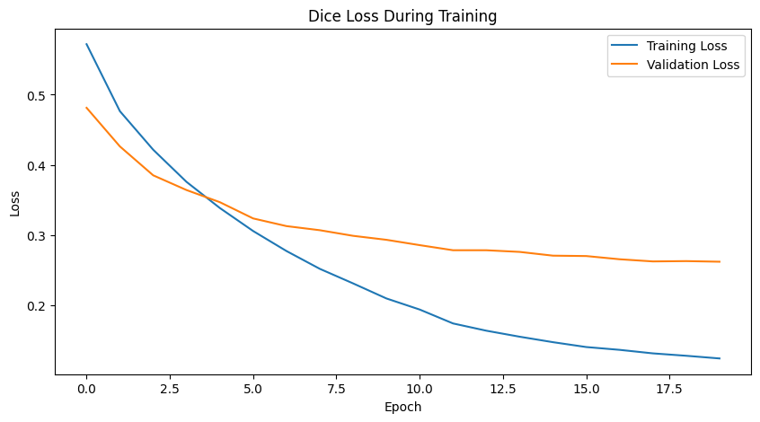

- Training loss decreases steadily, indicating successful optimization.
- Validation loss follows a similar trend and stabilizes, suggesting limited overfitting.
- The final model was selected using early stopping based on validation loss.

---

## Threshold Optimization (Validation)

The U-Net outputs **probability maps**, which must be converted into binary masks using a threshold.

Rather than fixing the threshold at a default value (e.g. 0.5), we select it **empirically** based on validation performance.

### Method
- Evaluate multiple threshold values in the range **0.05–0.95**
- For each threshold:
  - Convert predicted probabilities to binary masks
  - Compute the mean Dice score on the validation set
- Select the threshold that **maximizes validation Dice**

### Dice vs. Threshold

The curve below shows validation Dice score as a function of the probability threshold:

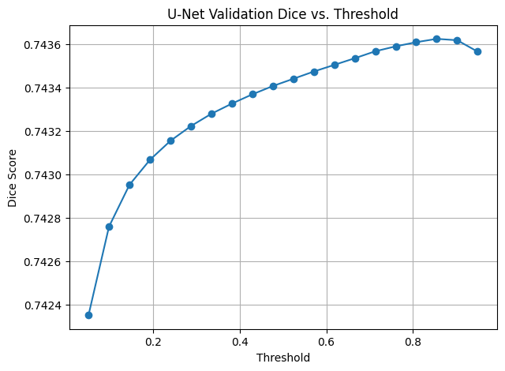

This analysis ensures that final segmentations use a threshold optimized for the model and dataset, rather than relying on a fixed heuristic.

---

## Inference Data Preparation (Test Set)

To run 2D U-Net inference on unseen 3D MRI scans, the test volumes are converted into a **slice-level DataFrame** and loaded through a lightweight PyTorch dataset.

### `build_test_df` — 3D scans → slice-level rows

For each test scan:
- Extract `patient_id` from the filename
- Load the 3D NIfTI volume
- Apply **axial orientation correction** (`check_axial_orientation`) to ensure consistent slice direction
- Split the volume into individual 2D axial slices

Each slice becomes one DataFrame row with:
- `patient_id`
- `slice_index` (z index)
- `img` (raw 2D slice, H×W)
- `orig_h`, `orig_w` (original scan dimensions for reconstruction)

### `MRITestDataset` — preprocessing per slice (model-ready)

Each slice is transformed into a tensor suitable for U-Net inference:
- Percentile clipping (default: 1st–99th) to reduce outliers
- Add channel dimension → `(1, H, W)`
- Resize + pad to a fixed square input (default: `1×512×512`)
  - Uses bilinear interpolation for images
- Z-score normalization (with a safe fallback when `std ≈ 0`)

The dataset returns:
- `x`: processed tensor `(1, 512, 512)` for inference
- `x_np`: original (clipped) 2D slice for plotting
- `patient_id`, `slice_index`
- `orig_h`, `orig_w` (for mapping predictions back to original resolution)

---

## Restoring Predictions to Original Resolution (Inference)

During inference, each 2D slice is resized + padded to a fixed square input (e.g., **512×512**) before being passed to the U-Net.  
To overlay predictions on the original MRI slice (and later reconstruct a full 3D mask), we invert that transformation for the predicted mask.

### `undo_resize_and_pad` — map predicted mask back to `(orig_h, orig_w)`

Given:
- `mask_512`: predicted binary mask at model resolution (`512×512`)
- `orig_h`, `orig_w`: original slice size before resizing/padding

This helper:
1. Recomputes the **same scale factor** used during preprocessing (`target_size / max(orig_h, orig_w)`)
2. Crops out the symmetric padding from the `512×512` mask
3. Resizes the cropped mask back to `(orig_h, orig_w)` using **nearest-neighbor interpolation** (to preserve binary labels)
4. Returns a NumPy mask aligned with the original MRI slice

This enables direct visualization and correct geometric alignment with the raw data.

---

## Qualitative Inference Visualization

### `predict_and_plot_grid` — patient × slice grid of predictions

For quick qualitative inspection, we generate a grid of model predictions:

- **Rows:** randomly selected patients  
- **Columns:** consecutive slices around the middle of each patient volume  

For each displayed slice:
1. Load the test slice from `MRITestDataset` (same preprocessing as training/inference)
2. Run the model to obtain a probability map
3. Threshold probabilities to a binary mask (using the selected `best_th`)
4. Use `undo_resize_and_pad` to restore the mask to the original resolution
5. Overlay the restored mask on the original slice

> This visualization helps verify that predictions are anatomically plausible and consistent across adjacent slices.

**Example qualitative results:**
- Before/after overlays, or a full grid image produced by `predict_and_plot_grid`

Example segmentation results are shown below.


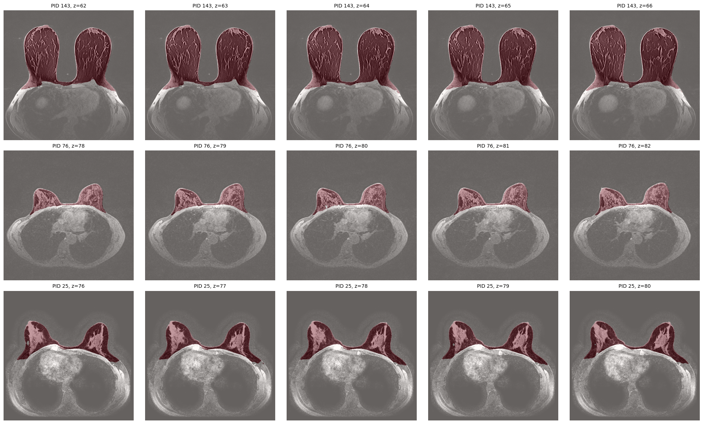
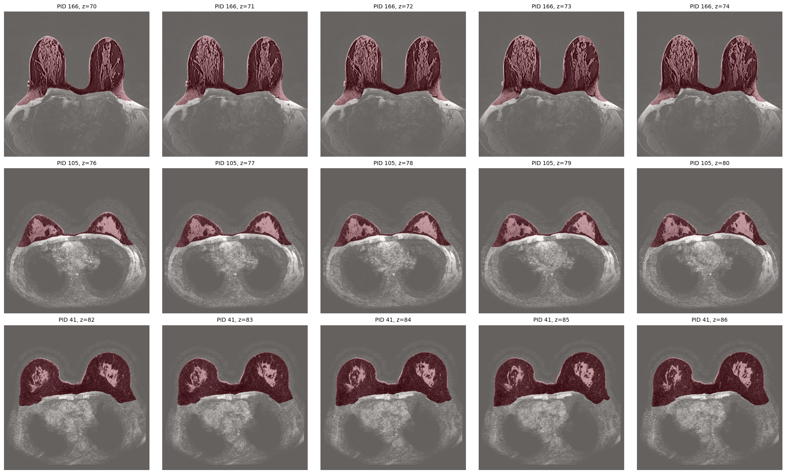

---

## Full Inference Pipeline: Breast Mask to Tumor Candidate to Features

This stage applies the trained model to **unseen test scans** and produces:
1. A **3D breast segmentation mask**
2. A **tumor candidate region** inside the breast
3. **Simple quantitative features** per patient

The pipeline operates slice-wise using a 2D U-Net and then reconstructs results at the 3D volume level.


### Slice-wise Inference → 3D Breast Mask

Each test scan is processed as follows:

- The 3D MRI volume `(H, W, Z)` is split into axial slices
- Each slice undergoes the **same preprocessing as training**:
  - Percentile clipping (1–99%)
  - Resize + pad to `(512 × 512)`
  - Z-score normalization
- The trained **2D U-Net** predicts a probability map per slice
- Probabilities are thresholded (e.g. `τ = best_th`)
- Predicted masks are mapped back to the **original slice resolution**
- All slices are stacked to form a **3D breast mask** `(H, W, Z)`

**Output:**  
- `breast_mask_3d` — boolean 3D mask of predicted breast tissue

---

### Tumor Candidate Detection Inside the Breast

To identify a potential tumor region:

- Analysis is restricted to voxels inside the predicted breast mask
- A **high-intensity threshold** is computed (e.g. 98th percentile within breast tissue)
- Voxels above this threshold are marked as candidates
- **3D connected-component analysis** is applied
- Only the **largest connected component** is retained as the tumor candidate

For this candidate, simple features are extracted:
- `volume_voxels` — size of the candidate
- `mean_intensity` — average signal intensity
- `max_intensity` — maximum signal intensity

**Outputs:**
- `tumor_mask` — 3D boolean mask
- `features` — dictionary of quantitative measurements

---

### Running the Pipeline on the Test Set

The full pipeline is applied to all test scans in a folder:

- Each scan is loaded and axially oriented
- A 3D breast mask is predicted
- A tumor candidate is detected
- Quantitative features are extracted

Results are aggregated into a **patient-level table**:

- One row per patient
- Indexed by `patient_id`
- Columns include:
  - `volume_voxels`
  - `mean_intensity`
  - `max_intensity`

This feature table can be used for:
- Exploratory analysis
- Correlation with clinical variables
- Downstream statistical or ML modeling


### Design Rationale

- **2D inference + 3D reconstruction** for efficiency
- **High-intensity filtering** to focus on suspicious regions
- **Largest connected component** for robustness
- Simple, interpretable features suitable for clinical analysis

---

## Correlation Between Imaging Features and Clinical Variables

After extracting tumor-related imaging features for each patient, we analyze their relationship with available clinical variables.

Imaging-derived features:
- `volume_voxels`
- `mean_intensity`
- `max_intensity`

Clinical variables (ordinal / categorical):
- `er`
- `pr`
- `her2`
- `mol_subtype`
- `nottingham_grade`

The imaging features are joined with the clinical table using an **inner join on patient ID**, ensuring that only patients with both imaging and clinical data are included.


### Correlation Analysis

For each clinical variable:

- A temporary dataset is created containing:
  - the three continuous imaging features
  - the selected clinical variable
- Rows with missing values for that clinical variable are removed
- A **correlation matrix** is computed between:
  - (`volume_voxels`, `mean_intensity`, `max_intensity`)
  - and the clinical variable
- Only the relevant correlations (imaging features vs. clinical variable) are retained

This process avoids contamination from missing data and allows a focused interpretation per clinical attribute.

---

### Visualization: Imaging–Clinical Correlation Heatmaps

For each clinical variable, a **small heatmap** is generated:

- **Rows:** imaging features  
  (`volume_voxels`, `mean_intensity`, `max_intensity`)
- **Column:** the clinical variable
- **Color scale:** correlation strength

Each heatmap answers the question:

> *How strongly does each imaging feature correlate with this specific clinical attribute?*

---

### Example Heatmaps

**ER status**

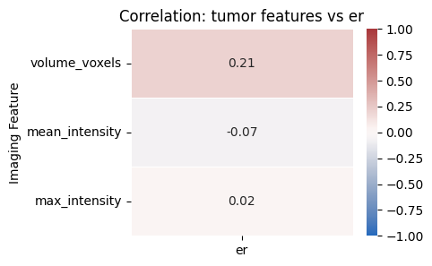


**PR status**

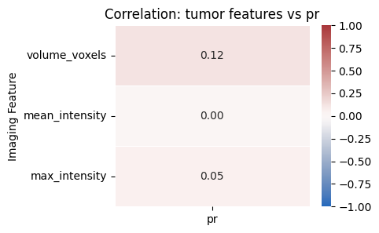


**HER2 status**

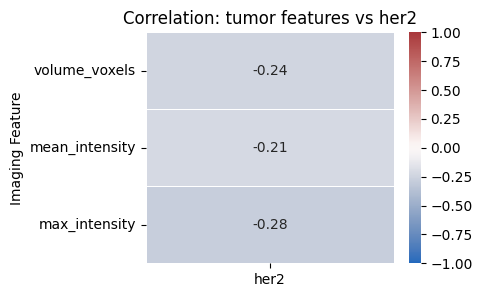


**Molecular subtype**

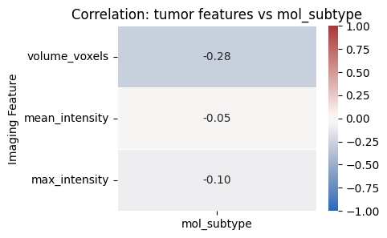


**Nottingham grade**

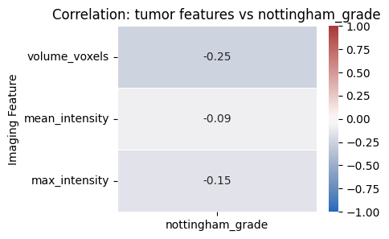


---

### Purpose and Interpretation

This analysis provides a **lightweight, interpretable bridge** between imaging-derived tumor characteristics and clinical variables.  
While not intended for causal inference, these correlations help identify patterns worth further investigation.


## Limitations and Future Work

### Limitations
- The dataset size is limited, and model optimization was intentionally lightweight.
- Imaging–clinical correlations are exploratory and not intended for causal inference.
- Slice-wise 2D modeling trades 3D spatial context for simplicity and robustness.

### Future Work
- Stronger data augmentation and cross-validation.
- Extension to 3D architectures.
- Incorporation of additional imaging modalities or multi-modal modeling.